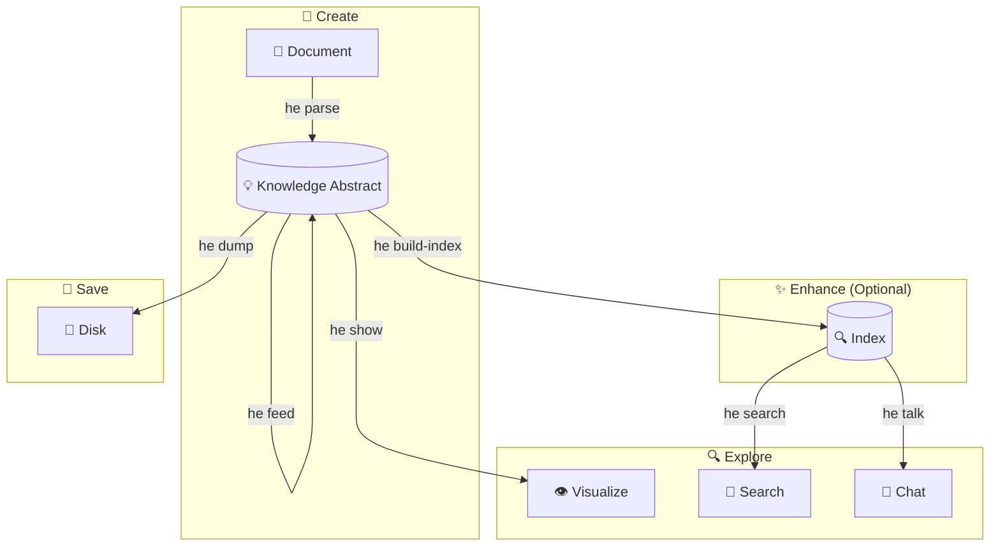

# CLI Guide

The Hyper-Extract CLI (`he`) provides a powerful, easy-to-use interface for knowledge extraction directly from your terminal.

---

## Installation

=== "uv (recommended)"

    ```bash
    uv tool install hyperextract
    ```

=== "pipx"

    ```bash
    pipx install hyperextract
    ```

Verify installation:

```bash
he --version
```

---

## Quick Command Reference

| Command | Purpose | Common Flags |
|---------|---------|--------------|
| `he parse` | Extract knowledge from documents | `-t` template, `-o` output, `-l` language, `--source` attribution |
| `he show` | Visualize knowledge graph | — |
| `he export obsidian` | Export to an Obsidian vault | `-o` output, `--name`, `-f` force |
| `he export graphml` | Export a pairwise graph to GraphML | `-o` output file |
| `he export jsonld` | Export pairwise edges and N-ary hyperedges to JSON-LD | `-o` output file, `-f` force |
| `he export csv` | Export nodes/edges as CSV tables | `-o` directory, `-f` force |
| `he search` | Semantic search in knowledge abstract | `-n` top-k results, `--source`, `--tag` |
| `he talk` | Chat with knowledge abstract | `-i` interactive, `-q` query |
| `he feed` | Add documents incrementally | `--source` attribution |
| `he info` | Show knowledge abstract statistics | — |
| `he build-index` | Build/rebuild search index | `-f` force rebuild |
| `he clean` | Remove a KA's index (or the whole KA) | `-a` all, `-y` yes |
| `he remove` | Delete nodes/edges by key, or soft-remove a single fact | `--node`, `--edge`, `--edit-node`, `--fact`, `--dry-run`, `--document`, `--strategy` |
| `he tag` | Manage source tags | `--source`, `--add`, `--remove`, `--list` |
| `he list` | List templates and methods | `template` or `method` |
| `he template validate` | Validate a template YAML file | `--json`, `--all` |
| `he config` | Manage configuration | `init`, `show`, `llm`, `embedder` |

---

## Complete Workflow

The typical workflow for extracting and interacting with knowledge:



1. **Create** — Extract knowledge from documents (`he parse`)
2. **Enhance** — Add documents incrementally (`he feed`), build index (`he build-index`)
3. **Explore** — Visualize (`he show`), search (`he search`), chat (`he talk`)
4. **Save** — Persist to disk (`he dump`)

→ [Detailed Workflow Walkthrough](workflow.md)

---

## Getting Started

### 1. Configure API Key

=== "OpenAI"

    ```bash
    he config init -p openai -k YOUR_OPENAI_API_KEY
    ```

=== "Bailian (Alibaba Cloud)"

    ```bash
    he config init -p bailian -k YOUR_BAILIAN_API_KEY
    ```

=== "DeepSeek"

    ```bash
    he config llm -p deepseek -k YOUR_DEEPSEEK_API_KEY
    he config embedder -p openai -k YOUR_OPENAI_API_KEY
    ```

=== "Anthropic (Claude)"

    Anthropic provides LLM only — pair with an OpenAI-compatible embedder:

    ```bash
    he config llm -p anthropic -k YOUR_ANTHROPIC_API_KEY
    he config embedder -p openai -k YOUR_OPENAI_API_KEY
    ```

=== "Local vLLM"

    First install [vLLM](https://docs.vllm.ai/) and start both services:

    ```bash
    # Start LLM service (~8GB VRAM)
    vllm serve Qwen/Qwen3.5-9B --port 8000 --api-key dummy

    # Start Embedding service (~2GB VRAM)
    vllm serve BAAI/bge-m3 --task embed --port 8001
    ```

    Then configure Hyper-Extract:

    ```bash
    he config llm -p vllm \
      -u http://localhost:8000/v1 \
      -k dummy \
      -m Qwen/Qwen3.5-9B

    he config embedder -p vllm \
      -u http://localhost:8001/v1 \
      -k dummy \
      -m BAAI/bge-m3
    ```

    > Full deployment options (quantization, Docker, etc.) see [Provider System](../concepts/provider-system.md).

### 2. Extract Knowledge

```bash
he parse document.md -t general/biography_graph -o ./output/ -l en
```

### 3. Visualize

```bash
he show ./output/
```

---

## Commands in Detail

### Knowledge Extraction

- **[`he parse`](commands/parse.md)** — Extract knowledge from documents
- **[`he feed`](commands/feed.md)** — Add documents to existing knowledge abstract

### Exploration

- **[`he show`](commands/show.md)** — Visualize knowledge graph
- **[`he search`](commands/search.md)** — Semantic search
- **[`he talk`](commands/talk.md)** — Chat with knowledge abstract
- **[`he info`](commands/info.md)** — View knowledge abstract statistics
- **[`he export obsidian`](commands/export.md)** — Export to an Obsidian vault
- **[`he export graphml`](commands/export.md#he-export-graphml)** — Export a pairwise graph to GraphML
- **[`he export jsonld`](commands/export.md#he-export-jsonld)** — Export pairwise edges and N-ary hyperedges to JSON-LD
- **[`he export csv`](commands/export.md#he-export-csv)** — Export nodes/edges as CSV tables

### Management

- **[`he build-index`](commands/build-index.md)** — Build search index
- **[`he clean`](commands/clean.md)** — Remove a KA's index, or the whole KA
- **[`he remove`](commands/remove.md)** — Delete nodes/edges by key, or soft-remove a single fact
- **[`he list`](commands/list.md)** — List available templates/methods
- **[`he template validate`](commands/template.md)** — Validate a template YAML file
- **[`he config`](commands/config.md)** — Configuration management

---

## Configuration

The CLI stores configuration in `~/.he/config.toml`.

→ [Configuration Reference](configuration.md)

---

## Template vs Method

Hyper-Extract offers two ways to extract knowledge:

### Templates (Recommended for Most Users)

Domain-specific, ready-to-use configurations:

```bash
he parse doc.md -t general/biography_graph -l en
```

### Methods (Advanced)

Underlying extraction algorithms:

```bash
he parse doc.md -m light_rag
```

→ [Learn when to use each](../concepts/architecture.md)

---

## Language Support

Templates support multiple languages:

```bash
# English
he parse doc.md -t general/biography_graph -l en

# Chinese
he parse doc.md -t general/biography_graph -l zh
```

Method templates always use English prompts.

---

## Examples by Use Case

### Research

```bash
# Extract from a research paper
he parse paper.md -t general/concept_graph -o ./paper_kb/ -l en

# Ask questions about it
he talk ./paper_kb/ -q "What are the main contributions?"
```

### Biography Analysis

```bash
# Extract from a biography
he parse biography.md -t general/biography_graph -o ./bio_kb/ -l en

# Visualize life events
he show ./bio_kb/
```

### Legal Document Analysis

```bash
# Extract contract obligations
he parse contract.md -t legal/contract_obligation -o ./contract_kb/ -l en

# Search for specific clauses
he search ./contract_kb/ "termination conditions"
```

---

## Tips and Best Practices

1. **Use templates for domain-specific tasks** — They're optimized for specific use cases
2. **Build the index** — Required for search and chat functionality
3. **Feed incrementally** — Add documents over time without reprocessing
4. **Choose the right language** — Improves extraction quality for non-English documents

---

## Getting Help

- View help for any command: `he <command> --help`
- List all templates: `he list template`
- List all methods: `he list method`
- [FAQ](../resources/faq.md)
- [Troubleshooting](../resources/troubleshooting.md)
