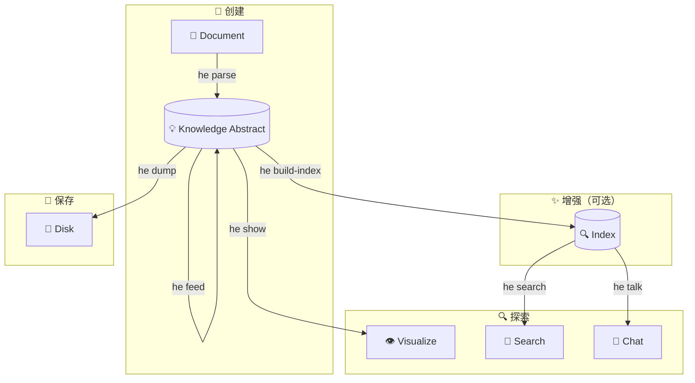

# CLI 指南

Hyper-Extract CLI (`he`) 提供了强大、易用的界面，可直接从终端进行知识提取。

---

## 安装

=== "uv (推荐)"

    ```bash
    uv tool install hyperextract
    ```

=== "pipx"

    ```bash
    pipx install hyperextract
    ```

验证安装：

```bash
he --version
```

---

## 快速命令参考

| 命令 | 用途 | 常用参数 |
|---------|---------|--------------|
| `he parse` | 从文档提取知识 | `-t` 模板, `-o` 输出, `-l` 语言, `--source` 来源标注 |
| `he show` | 可视化知识图谱 | — |
| `he export obsidian` | 导出为 Obsidian 知识库 | `-o` 输出, `--name`, `-f` 强制 |
| `he export graphml` | 导出二元 `<edge>` 与 N 元 `<hyperedge>` GraphML | `-o` 输出文件, `-f` 强制 |
| `he export csv` | 将节点/边导出为 CSV 表 | `-o` 目录, `-f` 强制 |
| `he search` | 知识库语义搜索 | `-n` top-k 结果数, `--source`, `--tag` |
| `he talk` | 与知识库对话 | `-i` 交互模式, `-q` 查询 |
| `he feed` | 增量添加文档 | `--source` 来源标注 |
| `he info` | 显示知识库统计信息 | — |
| `he build-index` | 构建/重建搜索索引 | `-f` 强制重建 |
| `he clean` | 删除 KA 的索引（或整个 KA） | `-a` all, `-y` yes |
| `he remove` | 按键删除节点/边，或软删除单条事实 | `--node`、`--edge`、`--edit-node`、`--fact`、`--dry-run`、`--document`、`--strategy` |
| `he tag` | 管理来源标签 | `--source`、`--add`、`--remove`、`--list` |
| `he list` | 列出模板和方法 | `template` 或 `method` |
| `he template validate` | 校验模板 YAML | `--json`、`--all` |
| `he config` | 管理配置 | `init`, `show`, `llm`, `embedder` |

---

## 完整工作流程

提取和交互知识的典型工作流程：



1. **创建** — 从文档提取知识 (`he parse`)
2. **增强** — 增量添加文档 (`he feed`)、构建索引 (`he build-index`)
3. **探索** — 可视化 (`he show`)、搜索 (`he search`)、对话 (`he talk`)
4. **保存** — 持久化到磁盘 (`he dump`)

→ [详细工作流程指南](workflow.md)

---

## 快速开始

### 1. 配置 API 密钥

=== "OpenAI"

    ```bash
    he config init -p openai -k YOUR_OPENAI_API_KEY
    ```

=== "百炼 (阿里云)"

    ```bash
    he config init -p bailian -k YOUR_BAILIAN_API_KEY
    ```

=== "DeepSeek"

    ```bash
    he config llm -p deepseek -k YOUR_DEEPSEEK_API_KEY
    he config embedder -p openai -k YOUR_OPENAI_API_KEY
    ```

=== "Anthropic (Claude)"

    Anthropic 仅提供 LLM —— 请搭配 OpenAI 兼容嵌入器：

    ```bash
    he config llm -p anthropic -k YOUR_ANTHROPIC_API_KEY
    he config embedder -p openai -k YOUR_OPENAI_API_KEY
    ```

=== "本地 vLLM"

    需先安装 [vLLM](https://docs.vllm.ai/) 并分别启动 LLM 和 Embedding 服务：

    ```bash
    # 启动 LLM 服务（约需 8GB 显存）
    vllm serve Qwen/Qwen3.5-9B --port 8000 --api-key dummy

    # 启动 Embedding 服务（约需 2GB 显存）
    vllm serve BAAI/bge-m3 --task embed --port 8001
    ```

    然后配置 Hyper-Extract：

    ```bash
    he config llm -p vllm \
      -u http://localhost:8000/v1 \
      -k dummy \
      -m Qwen/Qwen3.5-9B

    he config embedder -p vllm \
      -u http://localhost:8001/v1 \
      -k dummy \
      -m BAAI/bge-m3
    ```

    > 完整部署参数（量化、Docker 等）见 [Provider 系统](../concepts/provider-system.md)。

### 2. 提取知识

```bash
he parse document.md -t general/biography_graph -o ./output/ -l zh
```

### 3. 可视化

```bash
he show ./output/
```

---

## 详细命令

### 知识提取

- **[`he parse`](commands/parse.md)** — 从文档提取知识
- **[`he feed`](commands/feed.md)** — 向现有知识库添加文档

### 探索

- **[`he show`](commands/show.md)** — 可视化知识图谱
- **[`he search`](commands/search.md)** — 语义搜索
- **[`he talk`](commands/talk.md)** — 与知识库对话
- **[`he info`](commands/info.md)** — 查看知识库统计信息
- **[`he export obsidian`](commands/export.md)** — 导出为 Obsidian 知识库
- **[`he export graphml`](commands/export.md#he-export-graphml)** — 导出二元 `<edge>` 与 N 元 `<hyperedge>` GraphML
- **[`he export csv`](commands/export.md#he-export-csv)** — 将节点/边导出为 CSV 表

### 管理

- **[`he build-index`](commands/build-index.md)** — 构建搜索索引
- **[`he clean`](commands/clean.md)** — 删除 KA 的索引，或整个 KA
- **[`he remove`](commands/remove.md)** — 按键删除节点/边，或软删除单条事实
- **[`he list`](commands/list.md)** — 列出可用模板/方法
- **[`he template validate`](commands/template.md)** — 校验模板 YAML 文件
- **[`he config`](commands/config.md)** — 配置管理

---

## 配置

CLI 在 `~/.he/config.toml` 存储配置。

→ [配置参考](configuration.md)

---

## 模板 vs 方法

Hyper-Extract 提供两种提取知识的方式：

### 模板（适用于大多数用户）

特定领域的开箱即用配置：

```bash
he parse doc.md -t general/biography_graph -l zh
```

### 方法（高级）

底层提取算法：

```bash
he parse doc.md -m light_rag
```

→ [了解何时使用每种方式](../concepts/architecture.md)

---

## 语言支持

模板支持多种语言：

```bash
# 英文
he parse doc.md -t general/biography_graph -l en

# 中文
he parse doc.md -t general/biography_graph -l zh
```

方法模板始终使用英文提示。

---

## 用例示例

### 研究

```bash
# 从研究论文提取
he parse paper.md -t general/concept_graph -o ./paper_kb/ -l zh

# 提问
he talk ./paper_kb/ -q "主要贡献是什么？"
```

### 传记分析

```bash
# 从传记提取
he parse biography.md -t general/biography_graph -o ./bio_kb/ -l zh

# 可视化生平事件
he show ./bio_kb/
```

### 法律文档分析

```bash
# 提取合同义务
he parse contract.md -t legal/contract_obligation -o ./contract_kb/ -l zh

# 搜索特定条款
he search ./contract_kb/ "终止条件"
```

---

## 技巧和最佳实践

1. **为特定领域任务使用模板** — 针对特定用例进行了优化
2. **构建索引** — 搜索和聊天功能需要索引
3. **增量摄入** — 随着时间添加文档，无需重新处理
4. **选择正确的语言** — 改善非英文文档的提取质量

---

## 获取帮助

- 查看任何命令的帮助：`he <command> --help`
- 列出所有模板：`he list template`
- 列出所有方法：`he list method`
- [常见问题](../resources/faq.md)
- [故障排除](../resources/troubleshooting.md)
